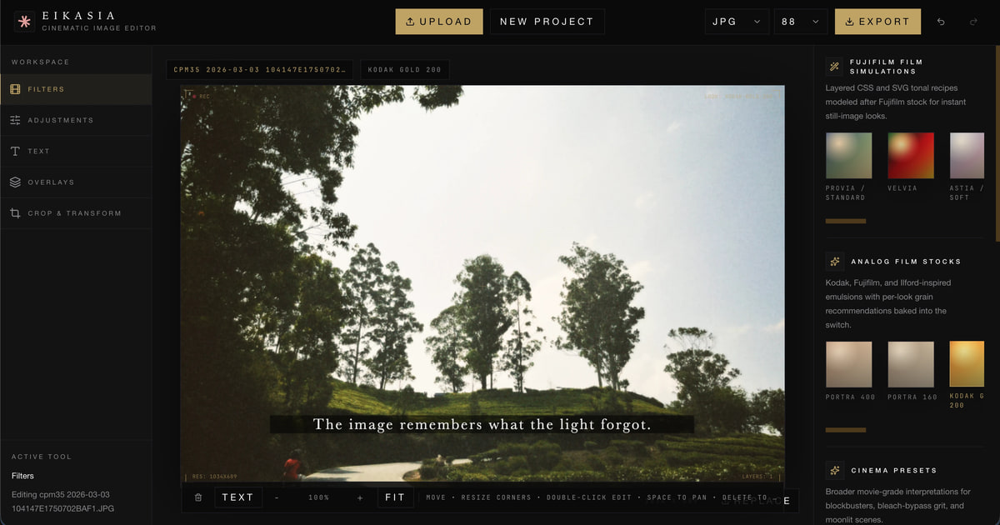

# Eikasia

Eikasia is a private, browser-based cinematic photo editor for film simulations, color grading, editorial text, overlays, and social-ready exports. Images are decoded, edited, and rendered locally in the browser; the application has no image-upload API.

[Open the editor](https://eikasia.anupbhat.com) · [Report a problem](https://github.com/AnupBhat30/eikasia/issues)



## Why Eikasia?

Eikasia combines the focused workflow of a film-camera app with the control of a desktop image editor:

- **Private by design:** source images remain in the browser.
- **Fast, non-destructive editing:** filters, adjustments, text, crop data, and overlays remain editable and support undo/redo.
- **Consistent preview and export:** the final image is rendered from project state instead of taking a screenshot of the interface.
- **Phone-first controls:** compact, touch-friendly tool drawers keep the image visible while editing.
- **Social-ready output:** dedicated profiles prepare correctly sized files for Instagram, Stories/Reels, and general social feeds.

## Features

- 54 film-inspired looks across Fujifilm, analog film, cinema, colorful, and chroma collections
- Exposure, tonal, color, clarity, texture, sharpening, edge-aware noise reduction, grain, vignette, halation, and fade controls
- Editable text layers plus 10 title, subtitle, credit, and film-stamp presets
- Grain, light-leak, flare, dust, and film-border overlays with blend and intensity controls
- 12 crop presets, free crop, straightening, rotation, flips, and perspective correction
- Mouse, trackpad, and multi-touch canvas pan/zoom controls
- Coalesced project history with undo and redo
- Responsive desktop and mobile interfaces
- JPEG and PNG export with preview, download, and native mobile sharing when supported

## Getting started

### Prerequisites

- [Bun 1.4.0](https://bun.sh/) or a compatible newer release
- A modern browser with JavaScript and Canvas support
- Git

The supplied scripts use the POSIX `env` utility. On Windows, run the project through WSL or another POSIX-compatible shell.

### Install and run

```bash
git clone https://github.com/AnupBhat30/eikasia.git
cd eikasia
bun install
bun dev
```

Open [http://localhost:3000](http://localhost:3000). No environment variables or external services are required for local development.

### Use the editor

1. Select **Upload** and choose an image, or drop one onto the canvas.
2. Choose a film look and adjust its strength.
3. Refine the image with **Adjustments**, **Text**, **Overlays**, and **Crop & Transform**.
4. Select **Export**, choose a destination profile and file format, then render the image.
5. Review the prepared file and download it or open the device share sheet.

Changes are held in memory for the current tab. Export work before refreshing, closing the tab, or starting a new project.

## Supported files and exports

### Input

Eikasia accepts PNG, JPEG, WebP, AVIF, HEIC, and HEIF images up to 50 MiB, 100 megapixels, and 24,000 pixels on either side. HEIC, HEIF, and AVIF availability depends on the browser's native decoder.

### Output

Exports are available as JPEG or PNG. JPEG quality can be selected before rendering.

| Profile | Maximum dimensions | Intended use |
| --- | ---: | --- |
| Instagram Feed | 1080 × 1440 | 3:4, 4:5, square, and landscape Instagram posts |
| Story / Reel | 1080 × 1920 | 9:16 full-screen content |
| Universal Social | 1080 × 1350 | Portable feed images kept below 5 MB |
| Original / Archive | 4096 × 4096 | Highest-resolution copy of the selected crop |

Social profiles preserve the crop's aspect ratio and never upscale a smaller source. If a JPEG exceeds a destination's size limit, Eikasia finds the highest quality that fits.

## Development commands

| Command | Purpose |
| --- | --- |
| `bun dev` | Start the webpack development server |
| `bun run lint` | Run ESLint with Next.js Core Web Vitals rules |
| `bun run typecheck` | Type-check the project without emitting files |
| `bun test` | Run the Bun test suite |
| `bun run check` | Run lint, type-checking, and tests in parallel |
| `bun run build` | Create a production webpack build |
| `bun run build:turbo` | Create a production Turbopack build |
| `bun start` | Serve an existing production build |

Before submitting a change, run:

```bash
bun run check
bun run build
```

## Architecture

Eikasia is a Next.js App Router application built with React, TypeScript, Tailwind CSS, Radix UI primitives, Fabric.js, and Bun.

| Path | Responsibility |
| --- | --- |
| `app/` | Application entry point, global styles, metadata, manifest integration, robots, and sitemap |
| `components/editor/` | Editor state, responsive shell, canvas interactions, inspectors, presets, and shared types |
| `components/ui/` | Reusable accessible controls built around Radix UI |
| `lib/exportImage.ts` | Filter pipeline, adjustments, overlays, text composition, and image encoding |
| `lib/social-export.ts` | Crop geometry, destination constraints, and export sizing |
| `workers/preview-render.worker.ts` | Off-main-thread preview rendering with `OffscreenCanvas` |
| `public/` | Favicons, web-app manifest artwork, and social preview assets |

The editor stores a non-destructive `ProjectState` in React context. Interactive changes schedule a quick preview followed by a refined frame; newer work replaces stale queued renders. Export uses the same state-driven raster pipeline at the selected output dimensions, including crop-aware text placement and overlays.

Tests live beside the modules they exercise and cover filter safety, adjustment layering, preview scheduling, canvas viewport math, crop geometry, and social export sizing.

## Deployment

Create and serve a production build with:

```bash
bun run build
bun start
```

The application does not require a database, object storage, API keys, or server-side image-processing service. It can be deployed to any platform that supports a Next.js server, including Vercel.

## Contributing

Contributions and bug reports are welcome:

1. Open an [issue](https://github.com/AnupBhat30/eikasia/issues) for bugs or substantial changes.
2. Fork the repository and create a focused branch.
3. Keep rendering behavior consistent between interactive preview and export.
4. Add or update tests for changes to filters, crop geometry, viewport movement, or export behavior.
5. Run `bun run check` and `bun run build` before opening a pull request.

Keep pull requests small enough to review, explain visible behavior changes, and include before/after images when changing the interface or render pipeline.

## Help and support

- Use [GitHub Issues](https://github.com/AnupBhat30/eikasia/issues) for reproducible bugs and feature requests.
- Include the browser, operating system, source format, output profile, and reproduction steps in bug reports.
- For security or private reports, contact the maintainer through the profile below instead of posting sensitive material publicly.

## Maintainer

Eikasia is created and maintained by [Anup Bhat](https://github.com/AnupBhat30).
